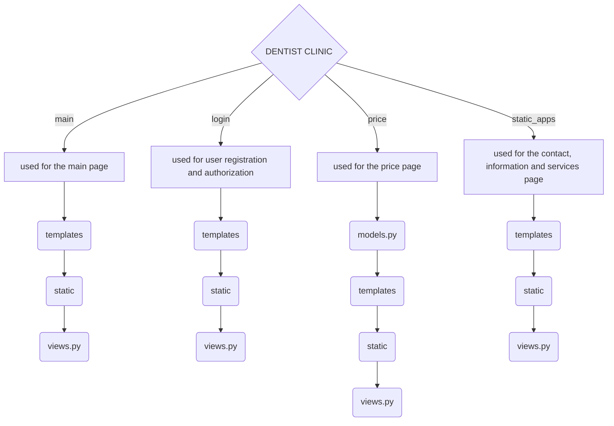

# Dentist Clinic

В цьому проекті ми працюємо над створенням веб-сайту для стоматологічної клініки.

## Швидка карту файлу
- [Dentist Clinic](#dentist-clinic)
  - [Швидка карту файлу](#швидка-карту-файлу)
  - [Учасники проекту](#учасники-проекту)
  - [Технології](#технології)
  - [Структура проекту](#структура-проекту)
  - [Початок роботи](#початок-роботи)
- [Моделі, використані у проекті](#моделі-використані-у-проекті)
  - [Category](#category)
  - [Service](#service)
- [Функції, використані у проекті](#функції-використані-у-проекті)
  - [Registration](#registration)
  - [Authorization](#authorization)
  - [Logout](#logout)
  - [Main](#main)
  - [Price](#price)
- [Використання javascript у проекті](#використання-javascript-у-проекті)
  - [Javascript in registration](#javascript-in-registration)
  - [Javascript in authorization](#javascript-in-authorization)

## Учасники проекту

1. Уляна Шамільова (Team Lead)
   
   - GitHub профіль: [UlyanaShamilova](https://github.com/UlyanaShamilova)
   
   - Figma проект: [Figma Project](https://www.figma.com/design/v8zsIeGGLNxgXN4j9VlyQQ/Untitled?node-id=0-1&t=M0h7vMHDwMcdirco-1)
   
   - FigJam проект: [FigJam Project](https://www.figma.com/board/uzB60e2o9Mh5KEZgq40tmA/Untitled?node-id=0-1&t=5ciEY9J7BZFZBO1C-1)
   
3. Павло Устич (Full Stack Developer)
   
   - GitHub профіль: [pavel-ustych-v](https://github.com/pavel-ustych-v)
   
   - Figma проект: [Figma Project](https://www.figma.com/design/iOp7LH5dnMdAzAsNeNc1YB/Dentists---project?t=BL1WdQzrCKhPzmMH-1)
   
    - FigJam проект: [FigJam Project](https://www.figma.com/board/rGsSmSDPyRF65GE1lg5KHn/Untitled?t=BL1WdQzrCKhPzmMH-1)
   
5. Назар Зозуля (Full Stack Developer)
   
   - GitHub профіль: [Nazar-Zozulya](https://github.com/Nazar-Zozulya)
   
   - Figma проект: [Figma Project](https://www.figma.com/design/U7j60sky15Ah4svZ5OkjAv/%D0%97%D0%B4%D0%BE%D1%80%D0%BE%D0%B2%D0%B0-%D0%BF%D0%BE%D1%81%D0%BC%D1%96%D1%88%D0%BA%D0%B0?node-id=0-1&t=YX774ACYa85vNaU1-1)
   
   - FigJam проект: [FigJam Project](https://www.figma.com/board/t4iufr1JmRpZwJla7kyWBI/%D0%97%D0%B4%D0%BE%D1%80%D0%BE%D0%B2%D0%B0-%D0%BF%D0%BE%D1%81%D0%BC%D1%96%D1%88%D0%BA%D0%B0-FigJam?node-id=0-1&t=Bjx14rXO9EI0TqFE-1)
   
7. Данило Кошнарьов (Full Stack Developer)
   
   - GitHub профіль: [DanilKoshnarev](https://github.com/DanilKoshnarev)
   
   - Figma проект: [Figma Project](https://www.figma.com/design/YpxoSvDuPoPzSRsXEfas5p/Untitled?node-id=0-1&t=10FxvHjbiRjT482v-1)
   
   - FigJam проект: [FigJam Project](https://www.figma.com/board/qk3eLvORSrN1Bz74wG4CIR/Untitled?node-id=0-1&t=EuJST6NJS6qIhpZS-1)

## Технології

- ***HTML/CSS*** - мови розмітки, які використовуються для створення та стилізації веб-сторінки;
- ***Python/Django*** - мовиапрограмування та її фреймворк, які використовуються для написання логіки веб-сайту;
- ***Ajax*** - використовується для асинхронної взаємодії з сервером для оновлення частини веб-сторінки без повного перезавантаження;
- ***SQLite3/MySQL*** - бази даних, які використовуються для зберігання даних користувача(логін, пароль) на сервері;
- ***Bootstrap*** - фреймворк для зручної та швидкої розробки інтерфейсу;
- ***Figma*** - інструмент для створення дизайну веб-сторінки без логіки.

<!-- ## Сторінки

- Головна
- Послуги
- Контакти
- Інформація
- Сторінки авторизації та реєстрації -->

## Структура проекту


## Початок роботи
1. Спочатку склонуйте репозиторій:
   ```
   git clone https://github.com/UlyanaShamilova/Dentist_Django.git
   ```
2. Перейдіть у директорію проекту:
   ```
   cd Dentist
   ```
3. Встановіть необхідні бібліотеки:
   django: фреймворк для роботи з веб-сайтом (https://www.djangoproject.com/).
    ```
    pip install django
    ```
4. Запустіть сервер
   ```
   python manage.py runserver
   ```

# Моделі, використані у проекті
## Category
```python
   class Category(models.Model):
      name = models.CharField(max_length=255)
```

Ця модель використовується для представлення категорії послуг. Наприклад, категорії включають такі елементи, як "Ортодонтичні послуги", "Хірургічні втручання" тощо.
Модель має 1 поле: назва категорії.

## Service
```python
   class Service(models.Model):
    name = models.CharField(max_length=255)
    price = models.CharField(max_length=255)
    category = models.ForeignKey(Category,related_name='select_category',on_delete=models.CASCADE) # Зв'язок моделей для зв'язування категорій та моделей
```

Ця модель використовується для представлення конкретної послуги, що надається клінікою. Наприклад, послуги включають такі елементи, як "Пломбування", "Видалення зуба" тощо.
Кожна послуга має три поля: назва послуги, ціна послуги, та категорію, до якої вона відноситься.

# Функції, використані у проекті

## Registration
Функція реєстрації користувача, яка перевіряє введення вірних даних:

```python
def reg_func(request):
    if request.method == 'POST':
        username = request.POST.get('username')
        email = request.POST.get('email')
        password = request.POST.get('password')
        confirm_password = request.POST.get('confirm_password')

        special_chars = ["@", ";", ",", "!", "$", "#", "%", "^", ":", "&", ".", "*", "(", ")", "[", "]", "{", "}", "_"]

        if username and email and password and confirm_password:
            if not any(char in username for char in special_chars):
                if '@' in email:
                    if password == confirm_password:
                        User.objects.create_user(
                            username=username,
                            email=email,
                            password=password
                        )
    return render(request, 'login/reg.html')
```
## Authorization
Функція авторизації користувача на сайті:

```python
def auth_func(request):
    if request.method == 'POST':
        username = request.POST.get('login')
        password = request.POST.get('password')

        if username and password:
            user = authenticate(username=username, password=password)
            if user:
                login(request, user)
                return redirect('main_page')  
    return render(request, 'login/auth.html')
```
## Logout
Функція виходу з акаунту на сайті:

```python
def logout_view(request):
    if request.method == 'POST':
        logout(request)
        return redirect('main_page') 
```

## Main
Функція, яка відправляє повідомлення з проблемою клієнта на пошту клініки:

```python
def main_func(request):
    if request.method == "POST":
        name = request.POST.get("name") # Ім'я користувача, яке беремо з текстового поля
        email = request.POST.get('email') # Пошта користувача, яку беремо з текстового поля
        problem = request.POST.get('problem') #Проблема користувача, яку беремо з текстового поля
        send_mail( # Метод відправлення повідомлення на пошту
            'Проблема', # Заголовок повідомлення
            f"Ім'я клієнта: {name} \nПроблема: {problem}", # Зміст повідомлення
            settings.EMAIL_HOST_USER, # Пошта, з якої відправляємо повідомлення, яку беремо з налаштувань
            [email] # Список отримувачів повідомлення
            )
    return render(request, 'main/main.html')

```

## Price
У цій функції ми отримуємо дані з моделей, і виводимо їх на сайт:

```python
def price_func(request):
    categories = Category.objects.all()
    if request.method == 'POST':
        print(123)
        if request.POST.get('search'):
            categories = categories.filter(name__icontains = request.POST.get('search'))
            
    return render(request, 'price/price.html', context = {'categories': categories,'services': Service.objects.all()})
```

# Використання javascript у проекті

## Javascript in registration
Тут ми отримуємо дані користувача з форми реєстрації, яку він заповнює, і перевіряємо на наявність помилок, не оновлюючи сторінки:

```javascript
$(document).ready(function() {
    $("#regBt").click(function(event) {
        event.preventDefault();
        var username = $("#username").val();
        var email = $("#email").val();
        var password = $("#password").val();
        var confirm_password = $("#confirm_password").val();
        var csrf_token = $("[name='csrfmiddlewaretoken']").val(); 

        $.ajax({
            url: "/reg/",
            type: "POST",
            data: {
                username: username,
                email: email,
                password: password,
                confirm_password: confirm_password,
                csrfmiddlewaretoken: csrf_token
            },
            success: function() {
                if (username && password && email && confirm_password) {
                    if (! email.includes("@", ";", ',', '!', '$', '#', ' %', '^', ':', '&', '.', '*', '(', ')', '[', ']', '{', '}')){
                        if (email.includes("@")){
                             if (password == confirm_password){
                                 $("#errorReg").text('Вас успішно зареєстровано!');
                                 $("#errorReg").css({'color':'red'})
                                 $("#username").text('');
                                 $("#email").text('');
                                 $("#password").text('');
                                 $("#confirm_password").text('');   
                                 }else {
                                     $("#errorReg").text('Паролі не співпадають, вас не зареєстровано!');
                                 }            
                             }else {
                                 $("#errorReg").text('Введіть коректну пошту, вас не зареєстровано!');
                             }   
                         }else {
                            $("#errorReg").text('Спеціальні символи, вас не зареєстровано!');
                         }
                    }else {
                        $("#errorReg").text('Заповніть усі поля, вас не зареєстровано!');
                    } 
                          
                }
})
})
})
```
## Javascript in authorization
Тут ми отримуємо дані користувача з форми реєстрації, яку він заповнює, і перевіряємо на наявність помилок, не оновлюючи сторінки:

```javascript

$(document).ready(function() {
    $("#authBt").click(function(event) {
        event.preventDefault();
        var username = $("#username").val();
        var password = $("#password").val();
        var csrf_token = $("[name='csrfmiddlewaretoken']").val(); 

        console.log('Starting AJAX request');

        $.ajax({
            url: "/auth/",
            type: "POST",
            data: {
                username: username,
                password: password,
                csrfmiddlewaretoken: csrf_token
            },
            success: function(response) {
                if (username && password) {
                    $('#authorized').text(username);
                    console.log('success ajax');
                } else {
                    $("#errorAuth").text('Заповніть усі поля, вас не авторизовано!');
                }
            }
        });
    });
});

```
